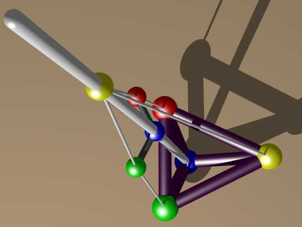

This is my GitHub home page.
I need a place where I can post something, so that I myself can read it,
very likely something out of context and / or about my my applications, 
[**RG**](tag/RG.html), 
[**FR**](tag/FR.html), 
[**SK**](tag/SK.html) and 
[**FC**](tag/FC.html).

*The RG Model* 

I start with content from the past like the image above or something from G+,
but the overall intent is to support project FR here at GitHub,
by being ready to respond with code snippets plus text when there happens to be a need for it.

GitHub is going to be the thing I think, but note that there is content on my *Federgraph* website,
including the imprint.

[Federgraph.de](https://federgraph.de){: .start-btn}
[FR Help pages](https://federgraph.github.io/fleetrace-help-en/){: .start-btn}
[GitHub Account](https://github.com/federgraph){: .start-btn}

[RG Logo](rg-logo.html)